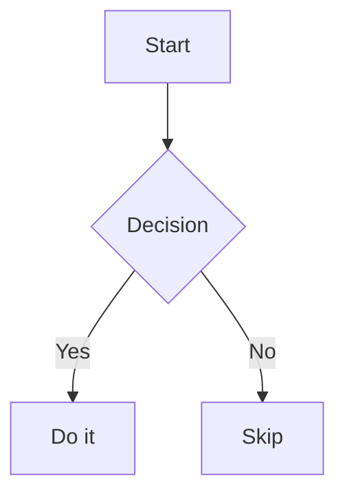

# User Guide & Keyboard Reference

Maximize your productivity with the Local Markdown Viewer.

## ⌨️ Global Keyboard Shortcuts

| Shortcut | Action |
| :--- | :--- |
| `Ctrl + O` | Open a local file (Markdown, PDF, DOCX, PPTX) |
| `Ctrl + S` | Save current file (Save As for untitled docs) |
| `Ctrl + Z / Y` | **Undo / Redo** last edit (Tracks 50-state history) |
| `Ctrl + M` | Export as Markdown file |
| `Ctrl + E` | Export as standalone HTML |
| `Ctrl + P` | Print / Export as PDF (Clean layout) |
| `Ctrl + /` | Cycle view modes: Split → Editor → Preview |
| `Ctrl + D` | Toggle Light / Dark theme |


> **Tip:** On macOS, use `Cmd` instead of `Ctrl` for all shortcuts.

---

## 🖱️ Power Interactions

- **Drag & Drop**: Drag any `.md`, `.pdf`, `.docx`, or `.pptx` file anywhere onto the app window to open or transform it instantly.
- **Dynamic Split**: Drag the center divider bar left/right to resize the editor and preview panes (15%–85% range).
- **Mobile Stacking**: On small screens, use the **bottom navigation bar** to toggle between Editor and Preview. In "Split" mode, the panes stack vertically (50/50) for a real-time mobile preview.
- **Sync Scroll**: When enabled (chain-link icon in toolbar), scrolling either pane scrolls the other proportionally.
- **Interactive Tasks**: Click any checkbox in the preview — the underlying Markdown source is updated automatically.
- **Copy Code**: Hover over any code block in the preview to reveal a copy button.

---

## 💾 Saving Files

| Scenario | Behavior |
|----------|----------|
| File opened via picker | `Ctrl+S` saves in-place (no dialog) |
| Untitled / new document | `Ctrl+S` opens a Save As dialog |
| Any document | `Ctrl+Shift+S` always opens Save As dialog |
| Browser without FSAPI | Falls back to a blob download |

The **Save button** in the toolbar turns **amber** whenever there are unsaved changes.

---

## 📑 Table of Contents

Click the **list icon** (bottom-right corner) to open the auto-generated Table of Contents. It parses all headings (`#` through `######`) from your Markdown and lets you jump directly to any section in the preview pane with a smooth scroll.

---

## 📝 Markdown Extensions

### GitHub-Style Alerts
```markdown
> [!TIP]
> A helpful tip shown in green.

> [!IMPORTANT]
> Critical information shown in purple.

> [!WARNING]
> Something to be careful about, shown in yellow.

> [!NOTE]
> General information shown in blue.
```

### Mathematical Notation (KaTeX)
Inline math with single `$`:
```markdown
The formula $E = mc^2$ is well known.
```

Display math with double `$$`:
```markdown
$$
i\hbar\frac{\partial}{\partial t}\Psi = \hat{H}\Psi
$$
```

### Mermaid Diagrams
````markdown

````

### Emoji Support
Type GitHub-style emoji shortcodes: `:rocket:` → 🚀, `:tada:` → 🎉

---

## 📦 Export Formats

### HTML Export (`Ctrl + E`)
Generates a fully self-contained `.html` file with inline styles matching GitHub's Markdown rendering. No external dependencies — share it with anyone.

### PDF Export (`Ctrl + P`)
Opens the browser's native print dialog. All UI chrome (toolbar, editor, status bar) is hidden automatically, leaving only the clean rendered preview for printing.
