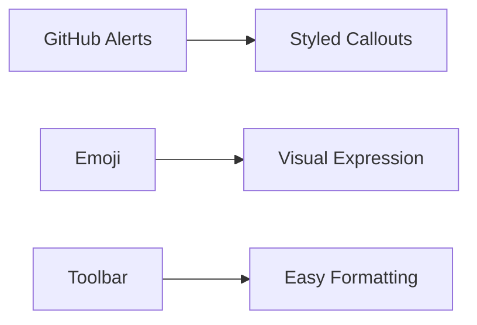

# Phase 2 Features Test

Test document for GitHub Alerts, Emoji Support, and Editor Toolbar.

## 1. GitHub Alerts

> [!NOTE]
> This is a note alert. Use it for helpful information.

> [!TIP]
> This is a tip alert. Perfect for best practices and suggestions.

> [!IMPORTANT]
> This is an important alert. Critical information that users must know.

> [!WARNING]
> This is a warning alert. Potential issues or compatibility problems.

> [!CAUTION]
> This is a caution alert. High-risk actions that could cause problems.

## 2. Emoji Support :rocket:

Use shortcodes to add emojis:
- :smile: Happy face
- :heart: Love
- :fire: Hot/trending
- :tada: Celebration  
- :bug: Bug
- :rocket: Launch
- :100: Perfect score
- :thumbsup: Approved

## 3. Editor Toolbar

The toolbar above the editor provides quick formatting:

**Try these buttons:**
1. **Bold** - Select text and click B
2. *Italic* - Select text and click I
3. ~~Strikethrough~~ - Select text
4. `Inline Code` - Wrap with backticks
5. # Headings - H1, H2
6. Lists - Bullet, Numbered, Task
7. [Links](url) - Insert link
8.  - Insert image
9. Tables - Auto-generate

## 4. Task Lists (Interactive - Coming Soon)

- [x] Completed task
- [ ] Pending task
- [ ] Another task

## 5. Mermaid Diagrams

## 6. Math with KaTeX

Inline: $E = mc^2$

Block:
$$
\int_{-\infty}^{\infty} e^{-x^2} dx = \sqrt{\pi}
$$

---

## All Features Working! :white_check_mark:

If you can see:
- ✅ Colored alert boxes
- ✅ Rendered emojis
- ✅ Formatting toolbar
- ✅ Mermaid diagram
- ✅ Math equations

Then Phase 2 is working perfectly! :tada:

## Interactive Task Lists
- [ ] Click me to toggle!
- [x] I am already done
- [ ] Another item

## Footnotes
Here is a sentence with a footnote[^1].

[^1]: This is the footnote content at the bottom.
